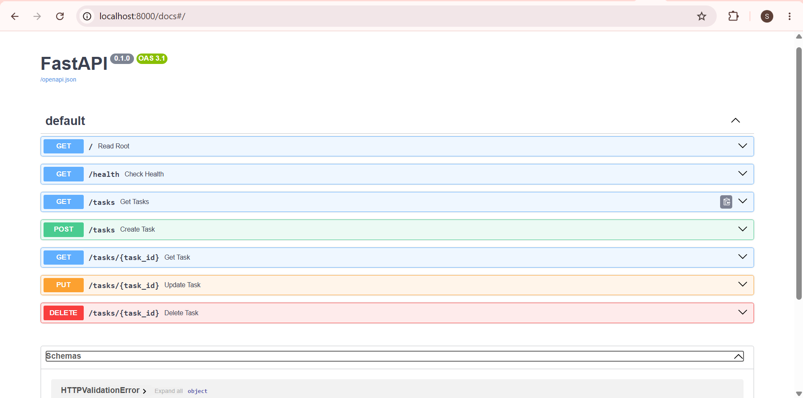
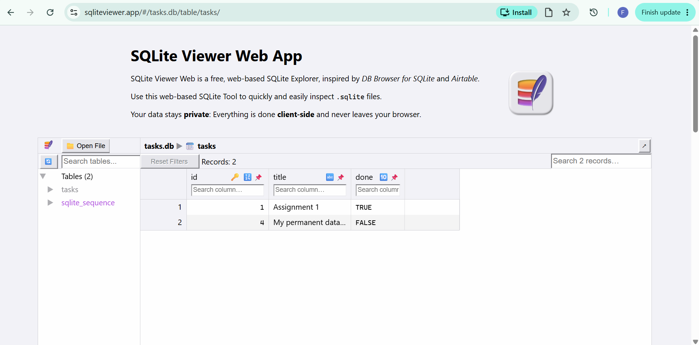

# FastAPI To-Do List

A simple, in-memory CRUD API for managing a To-Do list, built with Python and FastAPI.

## How to Run

Make sure you have your virtual environment activated, then run:
`uvicorn main:app --reload`

## Endpoints

| Operation | Method | Endpoint      | Description              |
| --------- | ------ | ------------- | ------------------------ |
| Info      | GET    | `/`           | API version and name     |
| Health    | GET    | `/health`     | Server health check      |
| Read All  | GET    | `/tasks`      | Returns all tasks        |
| Read One  | GET    | `/tasks/{id}` | Returns a specific task  |
| Create    | POST   | `/tasks`      | Creates a new task       |
| Update    | PUT    | `/tasks/{id}` | Updates an existing task |
| Delete    | DELETE | `/tasks/{id}` | Deletes a task           |

## Terminal Test Example

cmd.exe /c 'curl -i -X PUT http://localhost:8000/tasks/1 -H "Content-Type: application/json" -d "{\"done\":false}"'
HTTP/1.1 200 OK
date: Sat, 18 Jul 2026 01:16:25 GMT
server: uvicorn
content-length: 44
content-type: application/json

## Swagger UI Dashboard

## Database Storage

This project uses **SQLite** because it is a lightweight database that requires no external servers or installation. The data is stored locally in a file named `tasks.db`.

Because of the automatic initialization script in `main.py`, the database file and the `tasks` table are automatically created the first time you run `uvicorn main:app --reload`.

### Example SQL Query

To find all completed tasks manually, you can run:
`SELECT * FROM tasks WHERE done = 1;`

### Database Viewer

## Week 3: PostgreSQL & Docker Infrastructure

This API has been upgraded to run inside Docker containers using a PostgreSQL database.

**Architecture Proof:**
By utilizing the Repository pattern, the in-memory data store and SQLite database were completely swapped out for a robust PostgreSQL database. The transition was seamless—the service layer and API routes (`GET`, `POST`, `PUT`, `DELETE`) remained 100% unchanged. The client cannot tell the difference, proving the effectiveness of decoupled architecture.

**Persistence Test:**
Data persistence was verified by completing the following steps:

1. Spun up the stack using `docker compose up`.
2. Created a new task using the `POST /tasks` endpoint.
3. Completely destroyed the containers using `docker compose down`.
4. Restarted the stack and verified via `GET /tasks` that the newly created row survived the destruction via Docker volumes.
